<!-- Hero Section: Monochrome ASCII Portrait (types in row by row) beside 3D Extruded ASCII Wordmark (wipes in and rocks) -->
<h3><code>subham@github ~ $ whoami</code></h3>

<table>
<tr>
<td valign="top"></td>
<td valign="top"></td>
</tr>
</table>

 
 

<!-- Animated Contribution Graph: Real scraped data, diagonally revealed boxes, refreshed daily via GitHub Actions -->
<h3><code>subham@github ~ $ ./contributions.sh</code></h3>

 
 

<h3><code>subham@github ~ $ ./links.sh</code></h3>

<b>Software Engineer · AI Specialist · Open Source Contributor</b>

 

